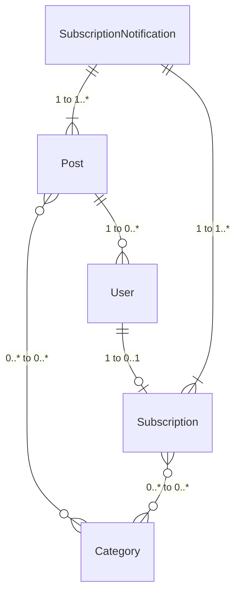

# Project Overview

This section is to provide a high level overview of the project. You
don't need to have a perfect mental model of the project, but knowing
how things generally fit together will be helpful.

## Model Relationships

There are only a few models, but they are inter-related. They are
Post, Category, User, Subscription, SubscriptionNotification.

- ``Post`` has a M2M (many to many) to ``Category``.
- ``Post`` has a FK (foreign key / 1 to many) to ``User``.
- ``User`` has a nullable 1:1 (one to one) to ``Subscription``.
- ``Subscription`` has a M2M to ``Category``
- ``SubscriptionNotification`` has a FK to ``Subscription``.
- ``SubscriptionNotification`` has a FK to ``Post``.

## Post

The Post model is worth discussing briefly as it's the center of the
project. The fields to be aware of are:

- ``is_public`` - Controls whether an unauthenticated user can view the post on the site.
- ``is_published`` - Signals that a post is no longer a draft and should be accessible to non-staff users.
- ``publish_at`` - Allows the author to schedule a post to be published in the future.
- ``publish_date`` - This is a calculated property that identfies the Post's publish datetime.
  It returns ``publish_at`` if set otherwise ``created``.
